<div align="center">

# 🎓 SmartAttend — Face Recognition Attendance System

### Mark attendance in seconds with face recognition. Role-based dashboards for admins, faculty, and students — with email alerts, PDF reports, and live analytics.

[](https://python.org)
[](https://flask.palletsprojects.com)
[](https://opencv.org)
[](https://sqlalchemy.org)
[](https://docker.com)
[](LICENSE)

</div>

---

## ⚡ Overview

**SmartAttend** is a full-stack attendance management platform that replaces manual roll-calls with automated **face recognition**. Faculty mark a whole class with a single photo, students track their own attendance in real time, and admins manage the entire institution from one dashboard.

Built with **Flask**, **OpenCV**, and **SQLAlchemy**, it ships with three distinct role-based portals, automated email alerts for low attendance, and exportable PDF reports.

---

## ✨ Features

| | |
|---|---|
| 📸 **Face Recognition** | Mark attendance from a single classroom photo using OpenCV |
| 👥 **Role-Based Access** | Separate, secured portals for Admin, Faculty, and Students |
| 🏫 **Course Management** | Create courses, enroll students, assign faculty |
| 📊 **Live Analytics** | Per-student, per-course, and institution-wide attendance charts |
| 📧 **Email Alerts** | Automatic low-attendance warnings (configurable threshold) |
| 📄 **PDF Reports** | Export attendance reports with ReportLab |
| ⏰ **Scheduled Jobs** | APScheduler-driven background tasks and reminders |
| 🐳 **Docker Ready** | One-command deployment with Docker Compose + Nginx |

---

## 🖼️ Screenshots

### Authentication
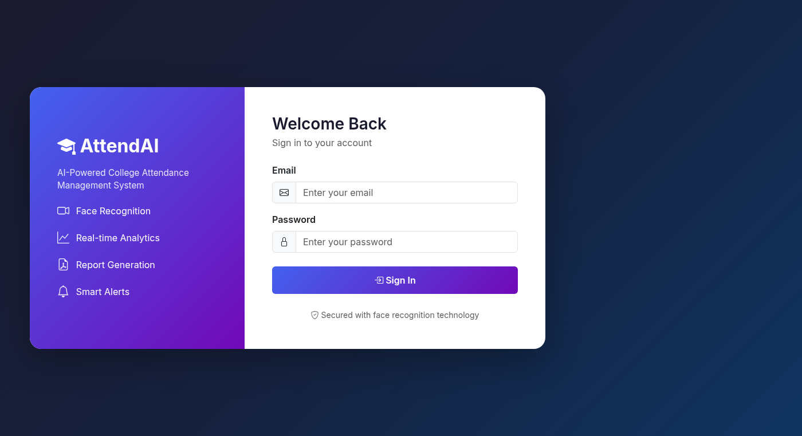

### Admin Portal
| Dashboard | Students | Courses | Analytics |
|---|---|---|---|
| 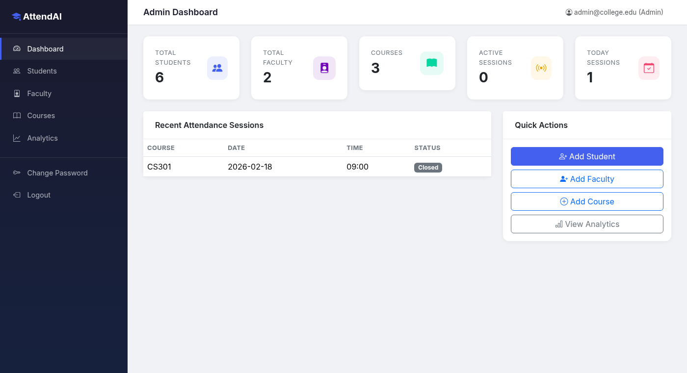 | 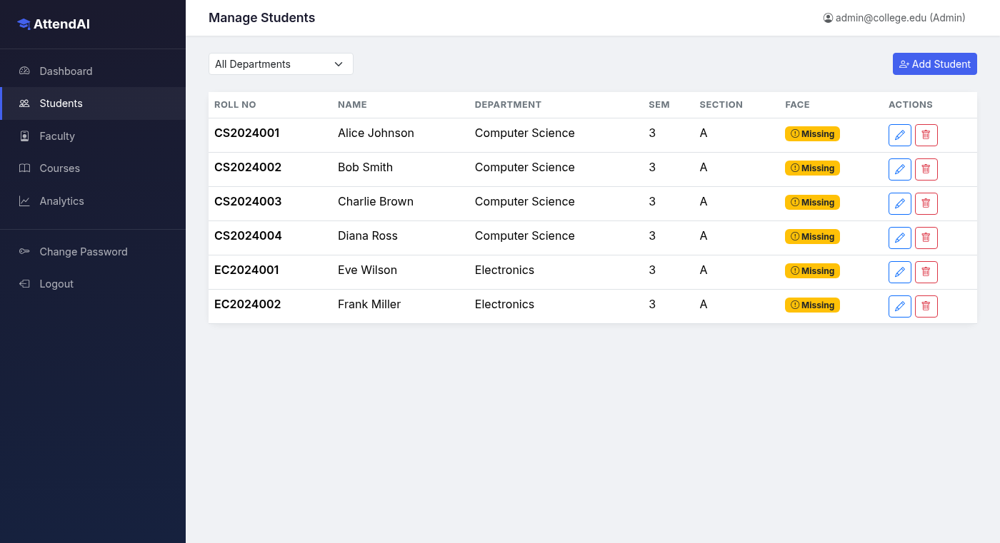 | 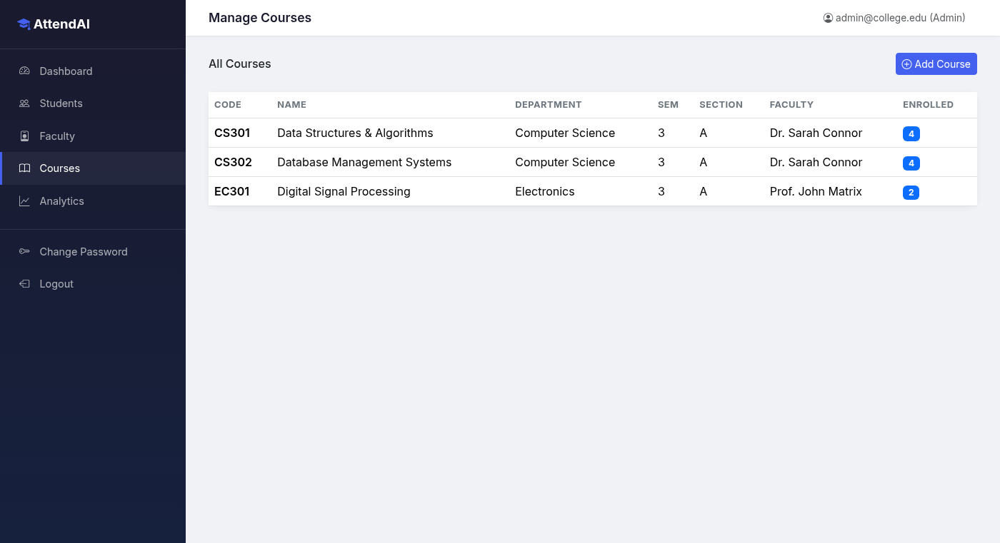 | 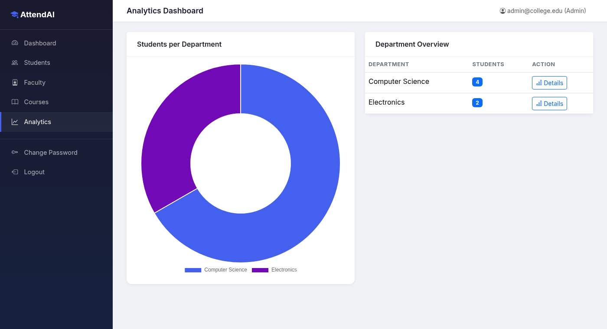 |

### Faculty Portal
| Dashboard | Mark Attendance | Course Report | Reports |
|---|---|---|---|
| 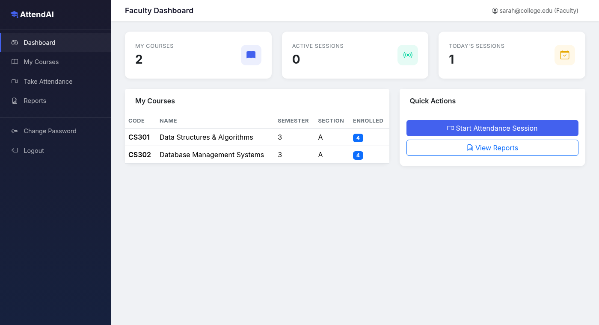 | 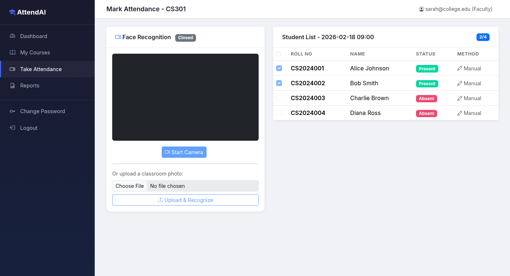 | 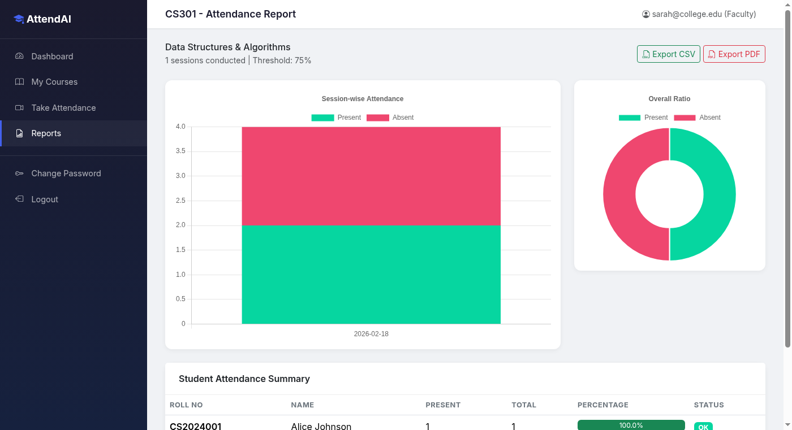 | 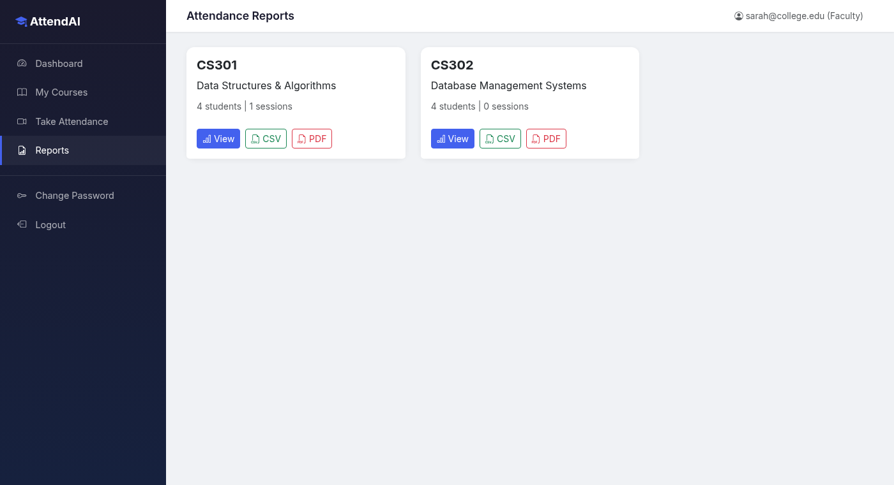 |

### Student Portal
| Dashboard | My Attendance | Analytics |
|---|---|---|
| 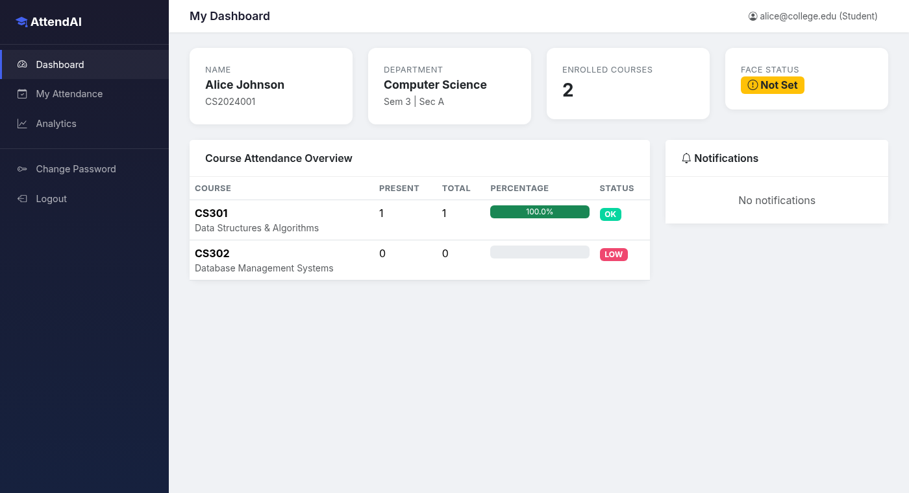 | 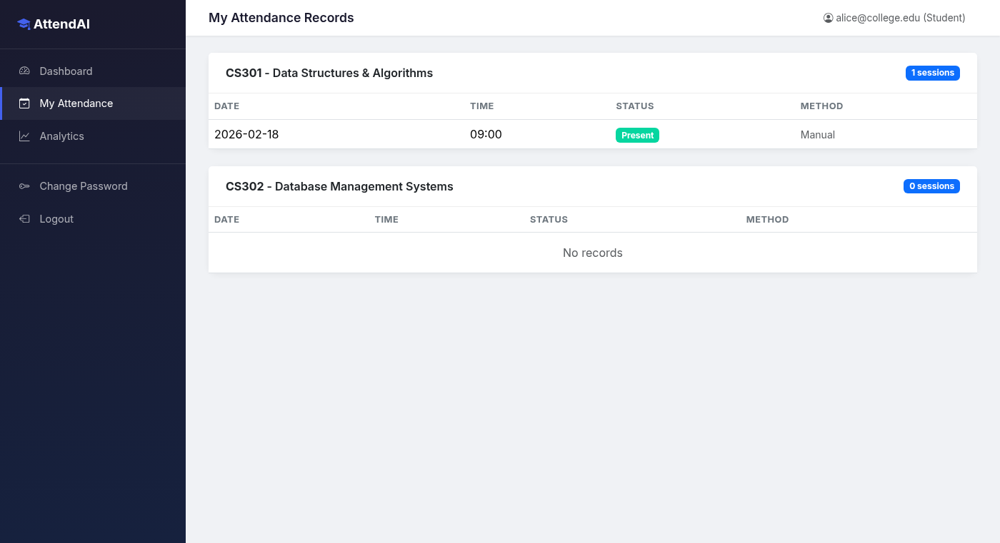 | 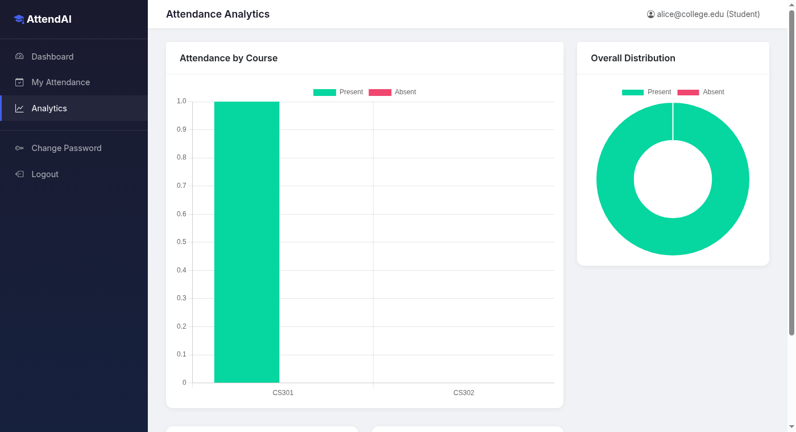 |

---

## 🛠️ Tech Stack

| Layer | Technology |
|-------|-----------|
| **Backend** | Python, Flask, Flask-Login, Flask-WTF, Flask-Migrate |
| **Database** | SQLAlchemy ORM (SQLite / PostgreSQL) |
| **Computer Vision** | OpenCV, NumPy, Pillow |
| **Reports & Charts** | ReportLab, Matplotlib, Pandas |
| **Email** | Flask-Mail (SMTP) |
| **Scheduling** | APScheduler |
| **Deployment** | Docker, Docker Compose, Nginx, Gunicorn |

---

## 🚀 Getting Started

### Prerequisites
- Python 3.10+
- (Optional) Docker & Docker Compose

### Local Setup

```bash
# 1. Clone the repo
git clone https://github.com/aasimansari1/project.git
cd project

# 2. Create a virtual environment
python -m venv venv
source venv/bin/activate        # Windows: venv\Scripts\activate

# 3. Install dependencies
pip install -r requirements.txt

# 4. Configure environment
cp .env.example .env            # then edit .env with your settings

# 5. Run the app
python run.py
```

Visit **http://localhost:5000** in your browser.

### Run with Docker

```bash
docker-compose up --build
```

---

## ⚙️ Configuration

Key settings in `.env` (see `.env.example`):

| Variable | Description |
|----------|-------------|
| `SECRET_KEY` | Flask secret key (change in production) |
| `DATABASE_URL` | SQLite or PostgreSQL connection string |
| `MAIL_USERNAME` / `MAIL_PASSWORD` | SMTP credentials for email alerts |
| `FACE_RECOGNITION_TOLERANCE` | Match strictness (lower = stricter) |
| `LOW_ATTENDANCE_THRESHOLD` | % below which alerts trigger (default 75) |

---

## 👥 User Roles

- **Admin** — Manage students, faculty, courses; view institution-wide analytics
- **Faculty** — Mark attendance via face recognition, generate course reports
- **Student** — View personal attendance records and analytics

---

## 🤝 Contributing

Contributions are welcome! Fork the repo, create a feature branch, and open a pull request.

---

## 📜 License

Released under the MIT License.

---

<div align="center">

**Built by [Mohd Aasim Ansari](https://github.com/aasimansari1)** · Aspiring Data Scientist & AI Engineer

</div>
